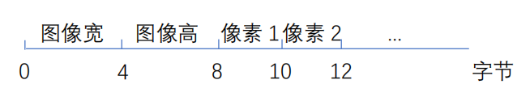
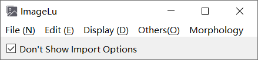
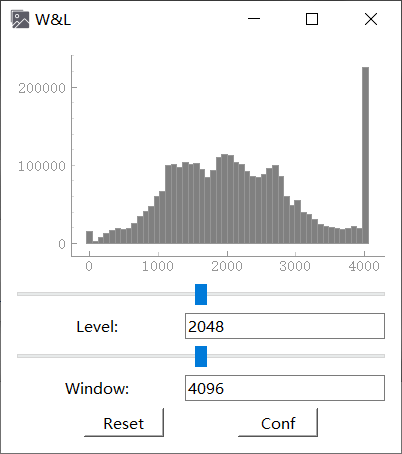
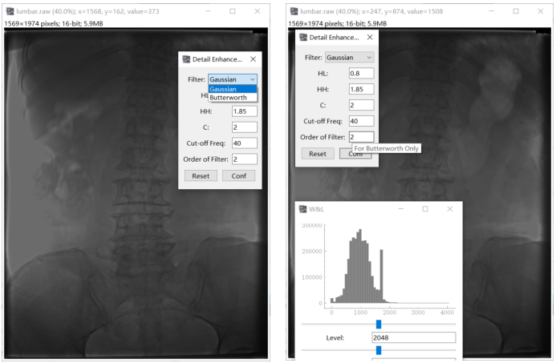
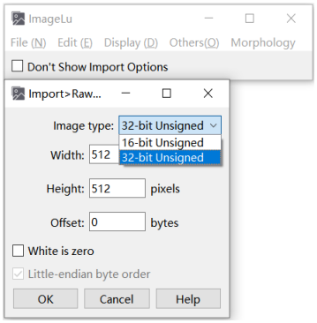

# ImageLu
# 医学图像基本阅片软件
外观仿制 ImageJ, 能够完成 4096 级灰度 DR / CT 图像处理

默认读入和保存的图像存储方式：


- 基本功能包括但不限于：原格式保存，灰度值映射，直方图显示 ( pyqtgraph )，图像拖拽，缩放，细节增强，频域显示，拉普拉斯锐化，中值滤波，基于形态学的边缘分割等


- 能够设定读入图像的一些基本参数和图像处理参数


- 其他：能够拖放图片打开多张图像，可以使用滚轮缩放，光标位置显示图像真实灰度值

### 部分菜单功能展示：

主菜单：



调整灰度窗，灰度直方图能够动态更新：



设置细节增强参数 ( 同态滤波 ) ( 非最终结果 )：



导入 raw 格式图像设置



PS: 附赠大津阈值分割，路径：
```angular2html
ImageLu\win\process\devide.py
```
